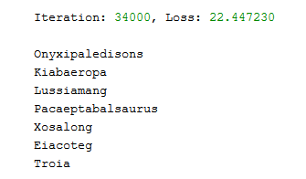

### Readme- Dinosaurs Name Generator

#### Brief Description-
- Here a character level language model is built using RNN and trained on a dinosaurs name dataset. The algorithm learns different name patterns and randomly generates new names.

#### Methods Used-
- RNN

#### Technologies Used-
- Python
- Numpy
- Matplotlib

#### Getting Started-
- Just clone the entire repo and run the Jupyter Notebook.

#### Output-
- 
- [Rest the output can be seen in Jupyter Notebook](https://github.com/gadia-aayush/Dinosaurs-Name-Generator/blob/master/dinosaur-island-character-level-language-modeling.ipynb).
